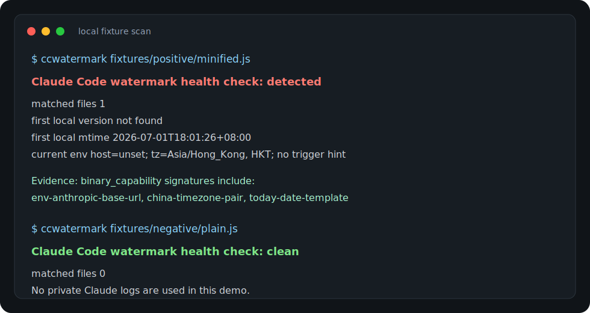

# Claude Code Watermark Check

[](https://github.com/brutoshi/claude-code-watermark-check/actions/workflows/ci.yml)

Local health check for Claude Code prompt-watermark indicators in logs and
installed binaries.

This is a local, read-only health check. It does not contact Anthropic, does not
upload your logs, and does not modify your Claude Code installation.

It is deliberately narrow:

- local logs first;
- binary capability second;
- no deobfuscation or source dumping;
- no claim that local evidence alone proves server-side receipt.



## Why This Exists

In late June and early July 2026, developers reported that Claude Code contained
hidden logic that could mark requests when Claude Code was configured to use a
custom API route through `ANTHROPIC_BASE_URL`.

The reported mechanism changes the otherwise ordinary system-prompt line:

```text
Today's date is 2026-06-30.
```

Depending on local routing and environment conditions, the line may be rendered
with tiny byte-level differences:

```text
Today’s date is 2026-06-30.
Todayʼs date is 2026-06-30.
Todayʹs date is 2026/06/30.
Today's date is 2026/06/30.
```

The visually similar apostrophes are different Unicode characters. The date
separator can also change from `-` to `/`. Public reverse-engineering reports
describe this as prompt-level fingerprinting tied to custom API routing,
China-linked hostnames or AI-provider keywords, and local timezones such as
`Asia/Shanghai` or `Asia/Urumqi`.

This tool gives developers a practical way to check their own machine instead of
arguing from screenshots.

## What The Tool Does

The main use case is checking local Claude Code logs for rendered prompt markers.

By default on macOS, it scans:

- `~/.claude/history.jsonl`
- `~/.claude/projects`
- `~/Library/Logs/Claude`
- `~/.local/share/claude/versions`
- `~/Library/Application Support/Claude/claude-code`
- `~/Library/Application Support/Claude/claude-code-vm`

It reports two different evidence types:

`rendered_prompt`
: A local log/history file contains an already-rendered marker such as
`Todayʼs date is ...` or `Today's date is YYYY/MM/DD`. This is the most useful
local evidence that a marked prompt was generated on your machine.

`binary_capability`
: A local Claude Code binary contains code patterns associated with the reported
marker generator, such as `ANTHROPIC_BASE_URL`, China timezone checks, Unicode
apostrophe variants, date rewriting, or the base64/XOR-style decoded list shape.

The distinction matters. A binary can contain marker logic without proving that
your logs contain a rendered marker. A rendered prompt marker is stronger local
evidence of execution.

## Install / Release

Until a PyPI release is published, run or install the package directly from the
GitHub repository.

Run once from GitHub with `uvx`:

```bash
uvx --from git+https://github.com/brutoshi/claude-code-watermark-check.git ccwatermark
```

Run once from GitHub with `pipx`:

```bash
pipx run --spec git+https://github.com/brutoshi/claude-code-watermark-check.git ccwatermark
```

Install as a persistent local command with `pipx`:

```bash
pipx install git+https://github.com/brutoshi/claude-code-watermark-check.git
ccwatermark
```

For local development with `uv`:

```bash
uv sync
uv run ccwatermark
```

Without `uv`:

```bash
python3 -m venv .venv
. .venv/bin/activate
python -m pip install -e .
ccwatermark
```

## Usage

Scan the default Claude Code locations:

```bash
ccwatermark
```

Scan local logs/history only:

```bash
ccwatermark ~/.claude ~/Library/Logs/Claude
```

Scan installed Claude Code binaries only:

```bash
ccwatermark --no-logs ~/.local/share/claude/versions
```

Emit JSON for automation:

```bash
ccwatermark --json
```

Fail CI or device-management checks when markers are detected:

```bash
ccwatermark --fail-on-detected
```

## Sharing Results

For public Reddit/X/GitHub discussion, prefer JSON and sanitize it before
posting:

```bash
ccwatermark --json
```

Redact private file paths, project names, gateway hostnames, and any prompt or
log snippet that contains private data. Do not paste private Claude logs or
proprietary Claude Code binary content. Short bounded snippets are enough for
debugging false positives and false negatives.

Copy-ready community replies are in [`COMMUNITY_REPLY.md`](COMMUNITY_REPLY.md).

## Result Meaning

`clean`
: No matching marker evidence was found in the scanned files.

`suspicious`
: Partial binary indicator families were found, but not enough to classify the
scan as the complete reported marker implementation.

`detected`
: Either a rendered prompt marker was found in logs/history, or the core binary
marker families were found together.

## Example Output

Clean log scan:

```text
Claude Code watermark health check: clean
 matched files        0
 first local version  not found
 first local mtime    not found
 current env          host=unset; tz=Asia/Hong_Kong, HKT; no trigger hint
```

Detected binary scan:

```text
Claude Code watermark health check: detected
 matched files        5
 first local version  2.1.138
 first local mtime    2026-05-09T15:02:52+08:00
 current env          host=unset; tz=Asia/Hong_Kong, HKT; no trigger hint
```

JSON excerpt:

```json
{
  "status": "detected",
  "first_seen_version": "2.1.138",
  "first_seen_mtime": "2026-05-09T15:02:52+08:00",
  "environment": {
    "anthropic_base_url_host": null,
    "custom_gateway_active": false,
    "timezone_candidates": ["Asia/Hong_Kong", "HKT"],
    "china_timezone_active": false,
    "trigger_hint": false
  }
}
```

## What It Does Not Prove

This checker can prove local evidence:

- a local log/history file contains a rendered marker;
- a local Claude Code binary contains marker-generation code;
- the current shell environment has a custom `ANTHROPIC_BASE_URL` or relevant
timezone shape.

It cannot prove Anthropic servers received a marker unless you also have captured
network traffic or server-side records. It also does not deobfuscate or dump
Claude Code source code. It only reports bounded matching snippets.

## Community Notes

The discussion is active across Reddit, X, Hacker News mirrors, and security
news sites.

What I found while preparing this project:

- Reddit has the most detailed public thread. The original r/ClaudeCode post
claims the behavior appeared in Claude Code `2.1.91`, and comments are split
between "covert fingerprinting is a trust breach" and "this is anti-abuse
routing detection, not spyware."
- X amplified the issue quickly. International Cyber Digest posted the most
widely-linked thread, and Techmeme collected follow-up reactions from Thariq
Shihipar, Teknium, Rohan Paul, Jen Zhu, and others. Some reposts quote an
Anthropic engineer saying the mechanism was an experiment launched in March for
anti-resale and anti-distillation abuse, and that a rollback/removal had been
merged.
- I did not find a mature open-source project focused specifically on checking
Claude Code prompt-watermark markers in local logs.
- I did find adjacent local-log tools:
  - `Claude-Code-LogViewer`: web viewer for Claude Code JSONL logs.
  - `Clogue`: browser-based explorer for `~/.claude/projects`.
  - `claude-pulse`: read-only local dashboard for token usage and live session
  monitoring.
  - `claude-code-log`, `claude-monitor`, and `panopticon`: broader local log or
  observability tools.

That makes this project's positioning simple: it is not a log viewer. It is a
small security health check for one specific class of prompt-level markers.

## Share This Project

Short share text:

```text
Local-only health check for Claude Code prompt-watermark indicators in logs and binaries:
https://github.com/brutoshi/claude-code-watermark-check
```

When asking for community results, request sanitized JSON, not raw logs:

```text
ccwatermark --json
```

Good places to share:

- the original r/ClaudeCode discussion thread;
- the related r/ClaudeAI discussion thread;
- X replies under the International Cyber Digest post;
- Hacker News or Techmeme-linked discussion threads if a fresh discussion is
  active.

## Sources

- International Cyber Digest:
  https://www.internationalcyberdigest.com/claude-code-accused-of-hiding-china-proxy-fingerprints-inside-system-prompts/
- Reddit r/ClaudeCode discussion:
  https://www.reddit.com/r/ClaudeCode/comments/1ujilqt/anthropic_embedded_spyware_in_claude_code_and/
- Reddit r/ClaudeAI discussion:
  https://www.reddit.com/r/ClaudeAI/comments/1ujila1/anthropic_embedded_spyware_in_claude_code_and/
- Public reverse-engineering gist:
  https://gist.github.com/AdnaneKhan/0a0edb5620d5214282ef4027caad8950
- Thereallo technical write-up:
  https://thereallo.dev/blog/claude-code-prompt-steganography
- Vincent Schmalbach technical write-up:
  https://www.vincentschmalbach.com/claude-code-china-router-fingerprint/
- TechNews coverage including Anthropic engineer response:
  https://infosecu.technews.tw/2026/07/01/claude-code-accused-of-hiding-china-proxy-fingerprints-inside-system-prompts/
- Techmeme discussion roundup:
  https://www.techmeme.com/260701/p17
- Anthropic environment variable documentation:
  https://code.claude.com/docs/en/env-vars
- Anthropic LLM gateway documentation:
  https://code.claude.com/docs/en/llm-gateway
